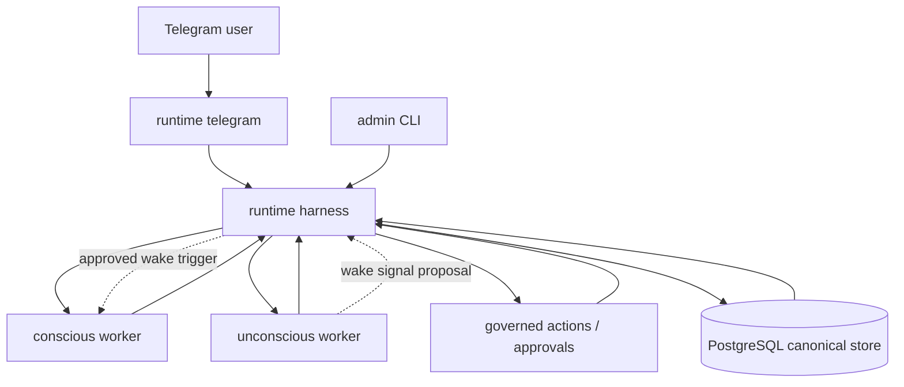
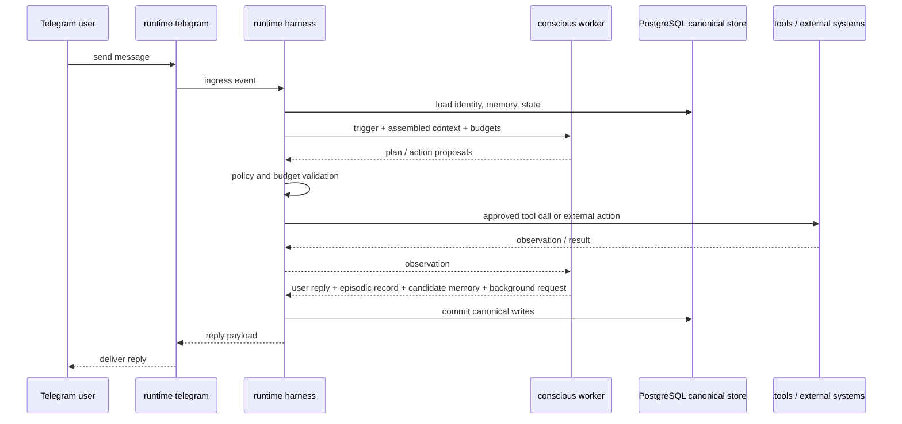
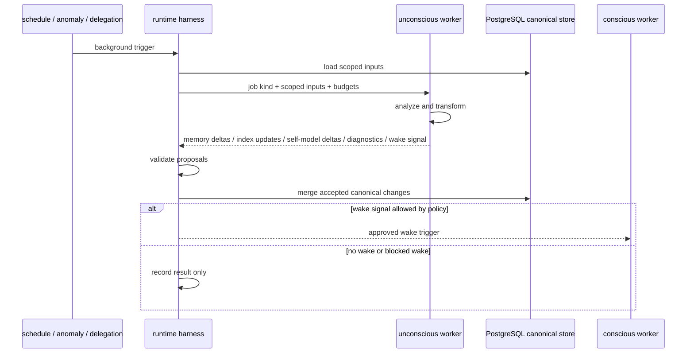
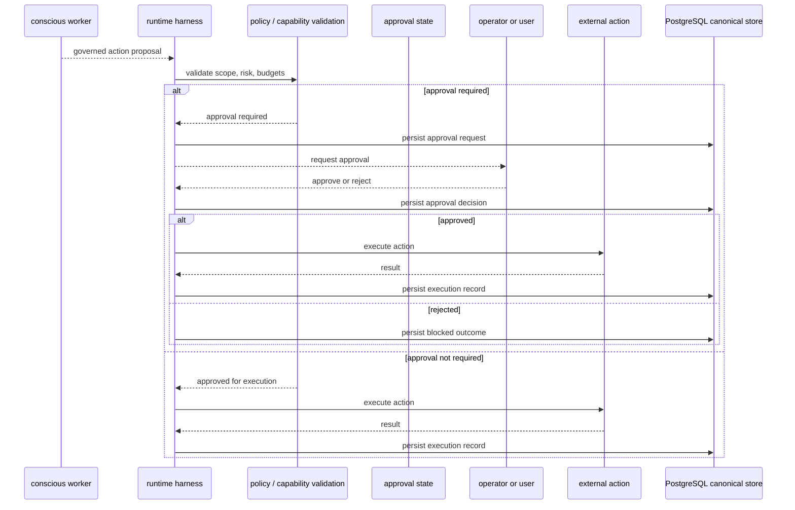
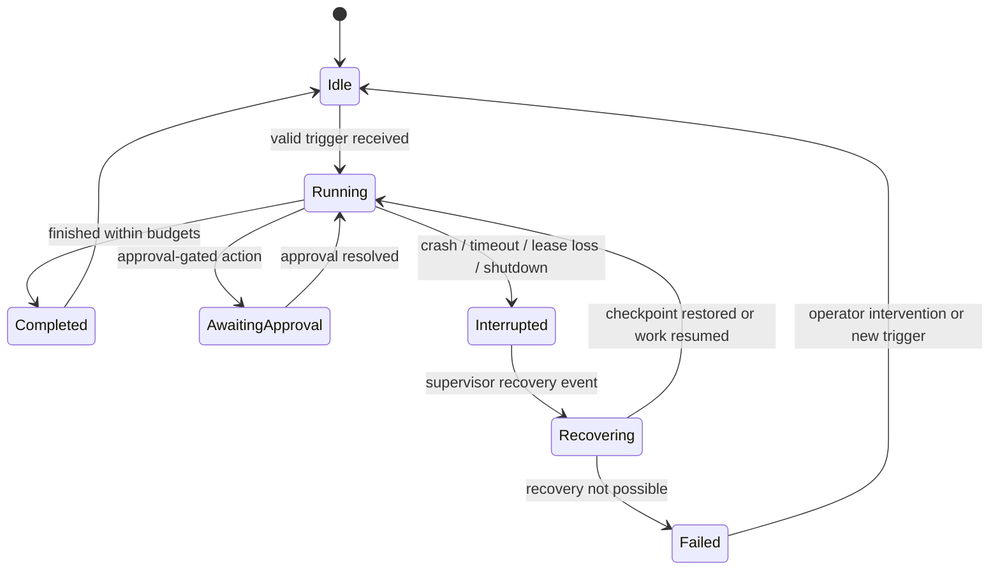
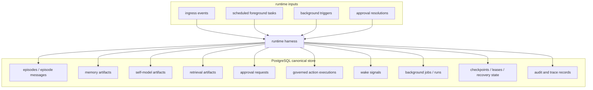

# Architecture Diagrams

## Purpose

This document provides the first repository-native diagram set for Blue Lagoon.
It is meant to be useful in two modes:

- as a usage guide for understanding how the runtime behaves
- as a development guide for refactoring and extension work

The diagrams here are intentionally focused. They complement
`docs/REQUIREMENTS.md`, `docs/LOOP_ARCHITECTURE.md`, and
`docs/IMPLEMENTATION_DESIGN.md`; they do not replace them.

## How To Use These Diagrams

- Start with the high-level runtime structure to understand boundaries.
- Use the foreground and background flow diagrams to understand execution.
- Use the governed-action and recovery diagrams before changing control flow.
- Use the persistence map before changing schema, merge paths, or audit logic.

## 1. High-Level Runtime Structure

Use this diagram first when you need to orient yourself in the system.

Development use:

- If a change crosses one of these arrows, it probably belongs in
  `crates/harness`.
- If a change bypasses the harness, it is probably violating an architectural
  invariant.

## 2. Foreground Request Flow

This is the primary user-facing execution path.

Development use:

- Change this flow when working on ingress, context assembly, tool execution,
  episodic recording, or user reply behavior.
- If a feature needs new foreground behavior, decide first whether it belongs
  before worker launch, inside worker reasoning, or in post-worker validation.

## 3. Background Maintenance Flow

This shows the bounded unconscious path.

Development use:

- Use this before changing background job kinds, proposal merging, or wake
  policy.
- If a background feature wants direct user output or direct writes, it is on
  the wrong side of the architecture boundary.

## 4. Governed Action And Approval Flow

This is the control path that matters most for safe side effects.

Development use:

- Read this before changing governed action JSON, capability scope checks, risk
  tiers, or approval resolution behavior.
- Side-effecting changes should preserve a clear persisted record of proposal,
  decision, execution, and outcome.

## 5. Recovery Lifecycle

This diagram summarizes the execution lifecycle around interruption and
recovery.

Development use:

- Use this before changing checkpoints, leases, recovery supervision, or resume
  semantics.
- If a new feature introduces long-lived work, it must still fit into this
  bounded lifecycle.

## 6. Canonical Persistence Map

This diagram shows what the harness owns in PostgreSQL and how major runtime
paths relate to canonical state.

Development use:

- Use this before changing migrations, persistence models, merge rules, admin
  surfaces, or traceability behavior.
- If a subsystem writes here directly without going through harness-owned paths,
  it is eroding the canonical write boundary.

## Suggested Next Diagram Work

The next useful diagrams after this first set are:

1. Context assembly internals for the conscious worker
2. Identity and self-model evolution flow
3. Trace explorer causal graph model
4. Admin surface to management-service mapping
5. Background job taxonomy and scheduling map

## Related Documents

- [docs/diagram-strategy.md](docs/diagram-strategy.md)
- [docs/REQUIREMENTS.md](docs/REQUIREMENTS.md)
- [docs/LOOP_ARCHITECTURE.md](docs/LOOP_ARCHITECTURE.md)
- [docs/IMPLEMENTATION_DESIGN.md](docs/IMPLEMENTATION_DESIGN.md)
